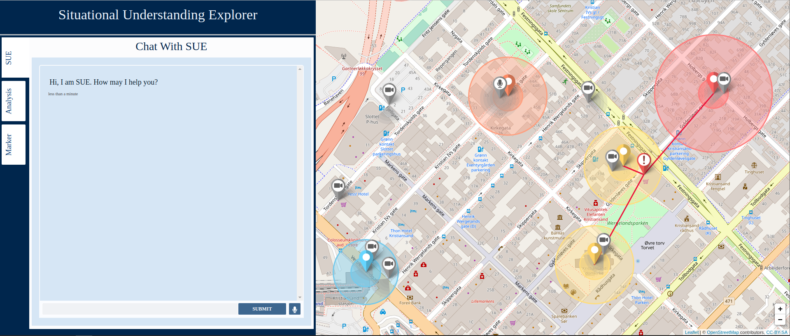

# SUE
Situational Understanding Explorer. An interface designed to showcase new situational awareness/ understandin research on a city-based map integration. This interface can take inputs in the form of JSON documents and display then as markers on the map, with features to allow user interaction and customisation.  
Currently being used to display sensors and events around a city, with sensors being data capturers, such as CCTV cameras and microphones, and events being AI detected anomolous events that are discovered within sensor feeds.  

## Features
### Chatbot
The interface features a chatbot through which users can customise the map, removing objects they don't want to see, to reduce potential clutter and assist in their situational understanding development.  

### Analysis Page
Featuring a bar chart of events sorted by priority, which can be used to focus the map view on events of one priority, and a timeline of events occuring for the last 5 minutes.

### WebSocket
The gif below shows the submission of a JSON object to the WebSocket (found at ws://localhost:8000) using Smart WebSocket Client for Google Chrome.  
*More information on how to form and send a WebSOcket request avaliable in WebSocket.md*

  

### Colour-Blindness Support
Using a command to enter accessibility mode in the Chatbot, the colour scheme used for events on the map changes to a colour blind friendly scheme.  

## Recommendations
It is recommended to run this interface on a:  
- (Ubuntu-based) Linux VM  

Viewing the interface with the browser:  
- Google Chrome

## Installation
### Linux
Clone this git repository and open a termial in the SUE folder, run  
$ bash linux-build.sh  
*This may take a while. If the installation pauses and asks you to confirm storage space requirements, enter y and it will continue.*  

## Running
### Linux
In a terminal in the SUE folder, run  
$ bash linux-run.sh  
*These scripts have set ports (8000, 8080, 8081, and 8082)*  

View the dashboard by opening a web browser and going to **http://localhost:8082/map.html**  

## Devlopment
A description of every function used in the web interface side of SUE can be found in **Functions.md**

## Further Development
### Online Hosting
Plans to host SUE online, so it can be quickly tested by anyone.  

### Creation of a True Conversational Interface
This functionality would allow users to enter a semantic description of an object into the Chatbot, and see SUE be updated with this information.  
#### Accepted semantic descriptions could include:  
* "event _ and event _ are linked" which would create a complex event link between the two  
* "create a new event / sensor", with ability to click where this new object should be on the map  
* other basic updates similar to those allowed through post on the websocket, name and priority changes, etc  
  
### Error Checks and Response 
This functionality would add an error checking and response for all post requests to the WebSocket.
They would check for missing information such as the name of an event, or anything else neede3d, and response to the client telling them that information was missing.  

### Mobile Interface
An interface accessibile through mobile devices which allows users to view events around them on the map, and send in a message describing an event they've witnessed, to appear on the map as human sensors.  
These messages could include just a semantic description, or a video or audio recording.  
This interface would use the user's GPS system to prevent them needing to enter a location manually.  
